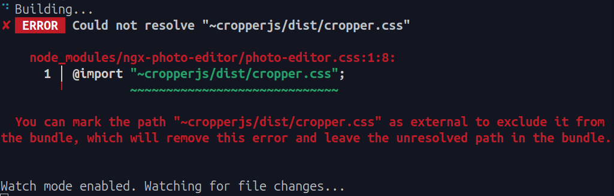

<h1  align="center">
FlowerMart
 
Primer Proyecto de
  
Desarrollo Web Front-End
</h1>

  

## Desarrolladores

- [Flores Rojas Tenoch Itzin](https://github.com/TenochFlores) (318027641)
- [Villafán Flores María Fernanda](https://github.com/FernandaVillafan) (318211767)

## Instalación

En una terminal, clonar el repositorio de GitHub: `git clone git@github.com:FernandaVillafan/DWF_2024-2.git`.

## Ejecución y Herramientas necesarias para correr el Back-End

Crear la base de datos con los archivos del directorio: `FlowerMart-DB/db-dwb_v2.0.0/db/`.

Una vez creada la base de datos, navegar al directorio: `FlowerMart-API/api-dwb_v2.0.1/api/`.

Ejecutar el archivo **JAR**: `java -jar dwf-api-2.0.6.jar`.

## Ejecución y Herramientas necesarias para correr el Front-End

En una terminal, navegar al directorio: `DWF_2024-2/flowermart`.

Instalar las dependencias necesarias para correr el Front-End: `npm install`.

Ejecutar el comando: `npm start`.

## Uso de la aplicación

Para poder acceder al sitio web, solo necesitamos redirigirnos a la siguiente página [HOME](http://localhost:4200/) con la que ya podemos empezar a interactuar.

- Aquí podemos encontrar un usuario que ya está registrado en la base de datos con el que podremos iniciar sesión:

**username :** `ivan.saavedra`

**password :** `12345678`

## Observación 

En caso de encontrarse con el error:

  

Abrir el archivo mencionado: `node_modules/ngx-photo-editor/photo-editor.css`.

Cambiar la primera línea por: `@import "cropperjs/dist/cropper.css";`.